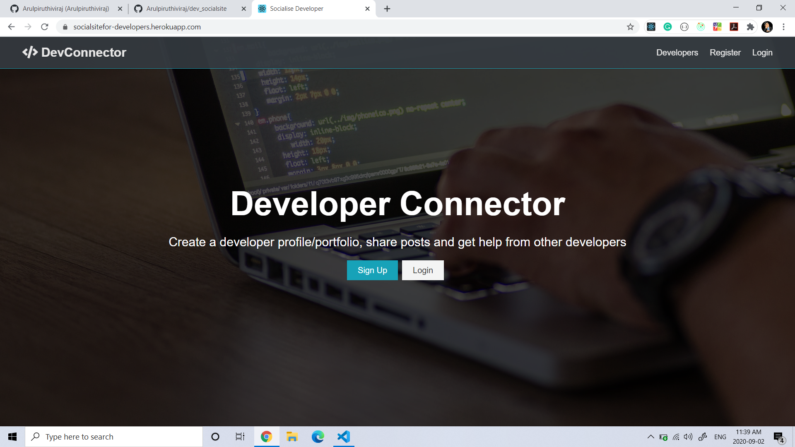
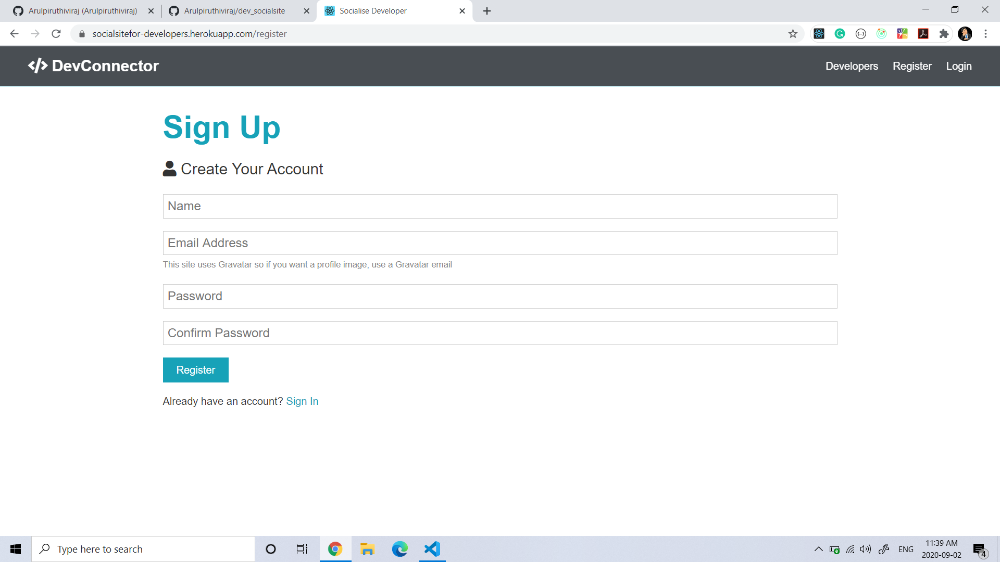
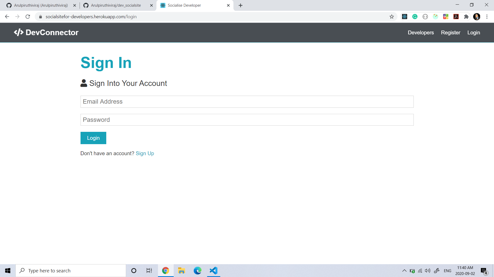
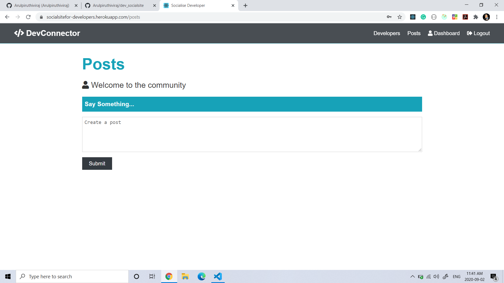
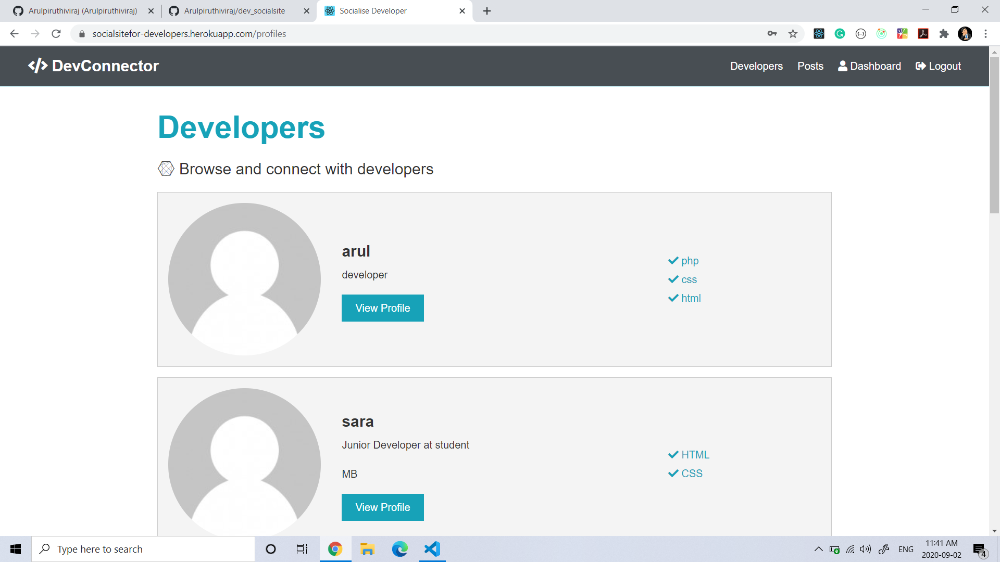

</p>



<h2 align="center"><a  href="https://socialsitefor-developers.herokuapp.com/">Live Demo</a></h2>

<!-- ### [Contributions are Welcome](https://github.com/silent-lad/VueSolitaire/blob/master/CONTRIBUTING.md) -->

## Description

Social Site for developers is a web app implamented with MERN stack where developers can connect with each other

## How to use

- **SignUp** SignUp to create a account and create a profile
- **SignIn** SignIn to a account if you have one

- **Post and have cono** You can post your thoughs and have convo
  

# About the project.

# Frontend

### React

- This Project is developed with React which is a javascript web framework,apps developed with react will be faster and deliver better UX.ReactJS was designed to help improve the total rendered pages from the website server

### redux

-for state managemnt,contetapi utilised

### CSS

- For stylig CSS and sass which is a preprocessor scripting language that is interpreted or compiled into Cascading Style Sheetsis used



# Frontend

## NodeJS

- Node.js is an open-source, cross-platform, JavaScript runtime environment that executes JavaScript code outside a web browser.

## ExpressJS

- Express.js, or simply Express, is a web application framework for Node.js, released as free and open-source software under the MIT License. It is designed for building web applications and APIs. It has been called the de facto standard server framework for Node.js.

## MongoDB

- MongoDB is a cross-platform document-oriented database program. Classified as a NoSQL database program, MongoDB uses JSON-like documents with optional schemas. MongoDB is developed by MongoDB Inc. and licensed under the Server Side Public License.

# Mobile Resposiveness

-Responsive design can help to solve a lot of problems . It will make site mobile-friendly, improve the way it looks on devices with both large and small screens, and increase the amount of time that visitors spend on site. This site is 100% mobile friendly.




## Project setup

Download or Clone the repository
create dotenv file using dotenvExample file and add ur own credentials
for frontend

```
cd client
npm install or yarn install
```

for backend

```
cd ..
npm install or yarn install
npm run dev
```

## Future scope

-Adding Animations and stylishing the screen

## Cheers....
